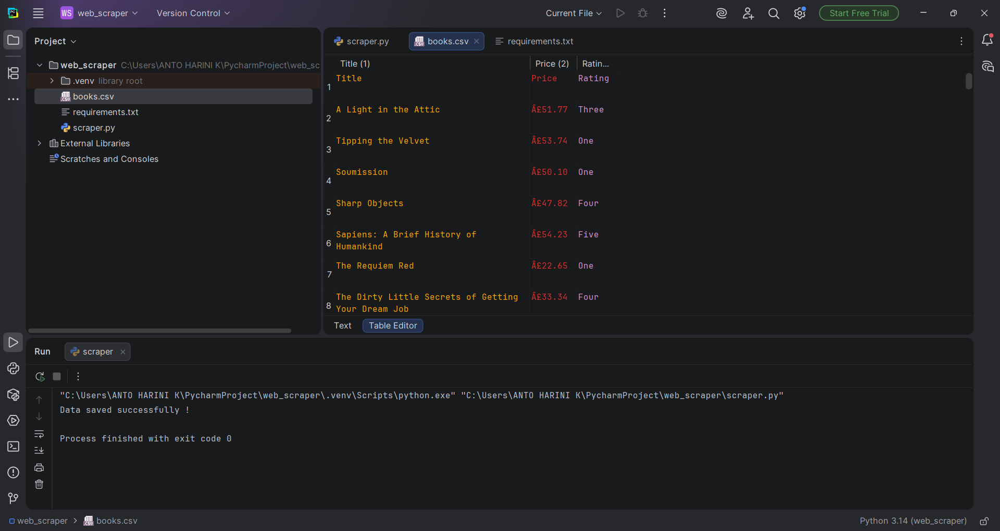

📚 Books Web Scraper

📌 Overview

This project is a Python web scraper that extracts book data (title, price, and rating) from a website and stores it in a CSV file.

🚀 Features

- Scrapes book title, price, and rating
- Extracts data from multiple pages
- Saves data into a CSV file

🛠️ Technologies Used

- Python
- Requests
- BeautifulSoup
- Pandas

▶️ How to Run

1. Install dependencies:
   pip install -r requirements.txt

2. Run the script:
   python scraper.py

📁 Output

- books.csv → contains scraped data in table format

📸 Screenshot

📌 Learning Outcome

Learned how to scrape data from websites, parse HTML, and store structured data using Python.
